## -Task Master-

Task Master es una aplicación web desarrollada con Flask que permite gestionar tareas
de manera eficiente, con autenticación segura, control de sesiones y sistema
de recuperación de contraseña.

## -Características-

* Registro e inicio de sesión de usuarios
* Gestión de tareas (crear, editar, eliminar, completar)
* Filtros de tareas (todas, activas, completadas)
* Sistema de sesión con expiración por inactividad
* Modal de advertencia de sesión
* Recuperación de contraseña por email (JWT)
* Protección CSRF
* Rate limiting (protección contra abuso)
* Diseño responsive moderno

## -Tecnologías-

* Python 3
* Flask
* SQLAlchemy
* Flask-Login
* Flask-WTF
* Flask-Mail
* Flask-Limiter
* MySQL
* Redis (rate limiting)

## -Instalación-

1. git clone https://github.com/jeshuamb/task-master.git
2. cd task-master
3. python -m venv venv
4. source venv/bin/activate  # Windows: venv\Scripts\activate
5. pip install -r requirements.txt

## -Configuración-

1. Copia .env.example y renómbralo a .env
2.  Configura tus variables de entorno

FLASK_APP=entrypoint
CONFIG_ENV=development

## -Dependencias externas-

Redis (Flask-Limiter)

Este proyecto utiliza Flask-Limiter para implementar protección
contra abuso mediante rate limiting.

Configuración actual:
storage_uri="redis://localhost:6379"

## -Importante para producción-

El sistema de rate limiting requiere Redis activo para funcionar correctamente.

Si Redis no está disponible:

* El rate limiter puede fallar
* La protección contra abuso no se aplicará correctamente
* Algunas rutas pueden comportarse de forma inesperada

## -Opciones de despliegue- 

Opción recomendada (producción)

Usar Redis como servicio externo:

* Redis Cloud
* Upstash
* Instancia Docker
* Redis en VPS

Ejemplo de configuración:

REDIS_URL=redis://:password@host:port/0

Y en la app:

storage_uri=os.getenv("REDIS_URL")

## -Opción alternativa (sin Redis)-

storage_uri="memory://"

Esta opción:

* No es persistente
* No es escalable
* No recomendada para producción

## -Recomendación-

Para producción real se recomienda usar Redis externo, especialmente cuando:

* La aplicación tiene usuarios reales
* Se requiere protección contra ataques de fuerza bruta
* Se usan múltiples instancias del servidor

## -Ejecución-

flask run

## -Seguridad implementada-

* Hash de contraseñas
* CSRF Protection
* JWT para recuperación de contraseña
* Rate limiting (Flask-Limiter)
* Expiración de sesión por inactividad
* Cookies seguras en producción

## -Acerca de este proyecto-

Task Master nació como un proyecto personal para mejorar mis habilidades con Flask y aprender a construir una aplicación completa con autenticación, sesiones seguras y manejo de usuarios reales.

## -Vista de la app-

### Home
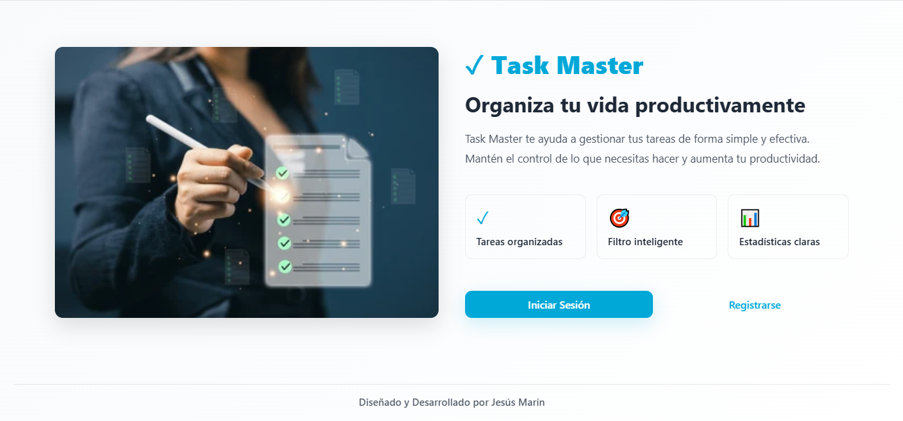

### Registro de Usuarios
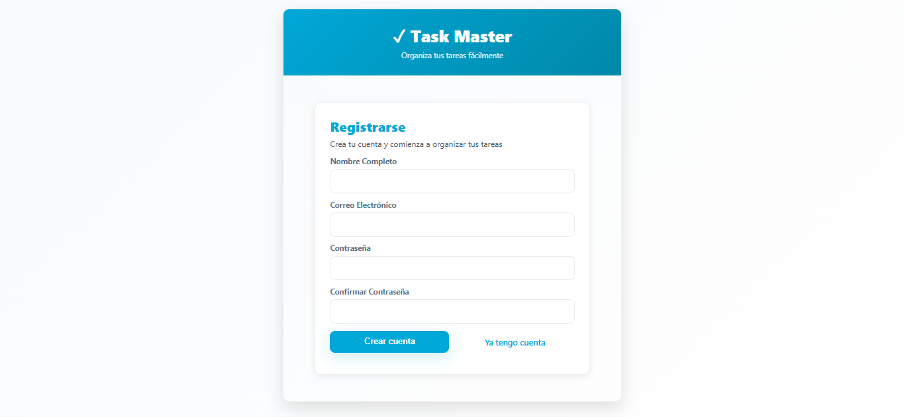

### Inicio de Sesión
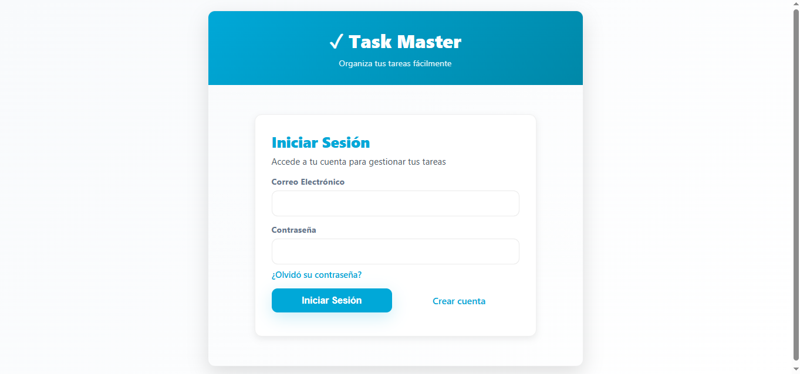

### Restablecimiento de la Contraseña
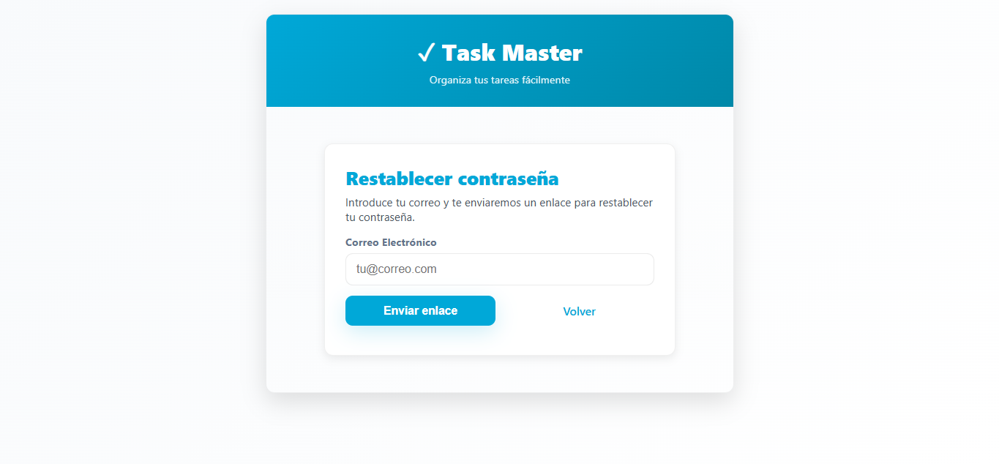

### Task Master
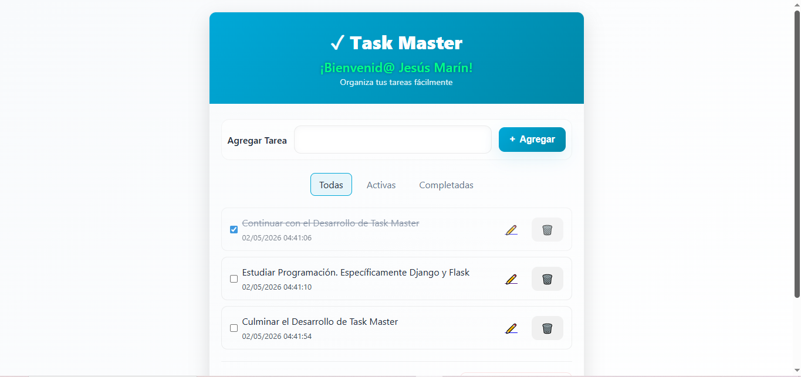

### Task Master
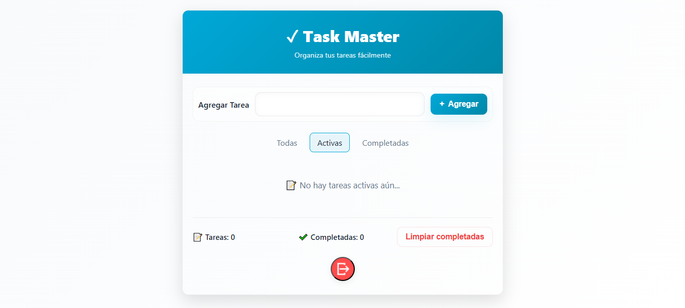

### Task Master
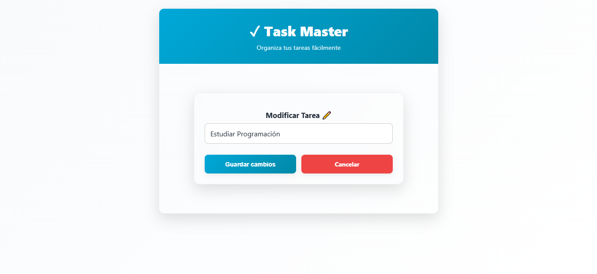

### Modal Sesión
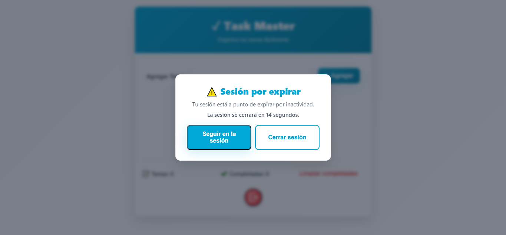

### Cierre Automático
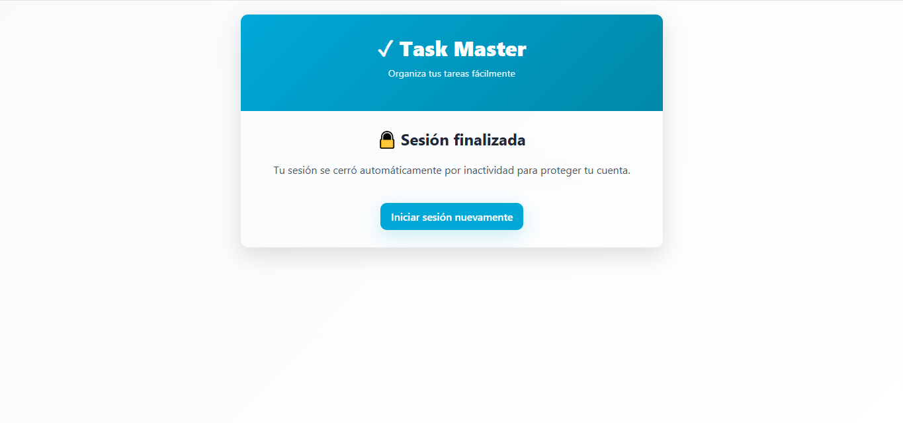

### Manejo de Errores (404)

### Manejo de Errores (405)
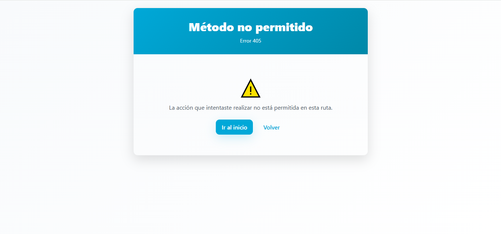

### Manejo de Errores (429)
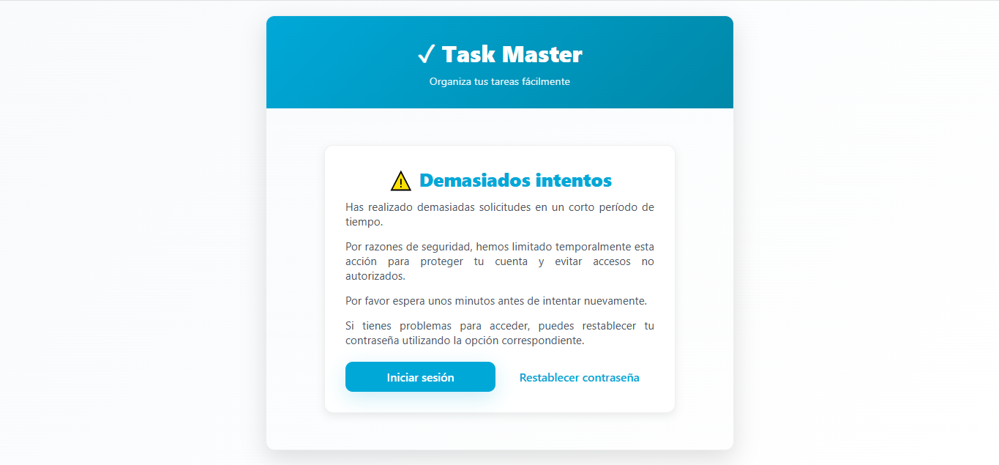

## -Autor-

Jesús Marín
